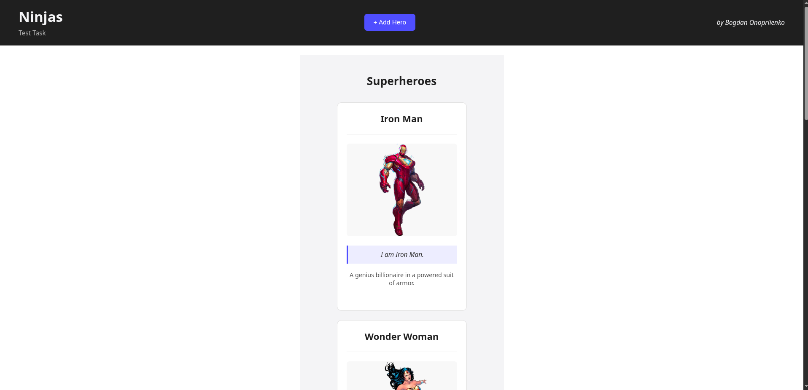
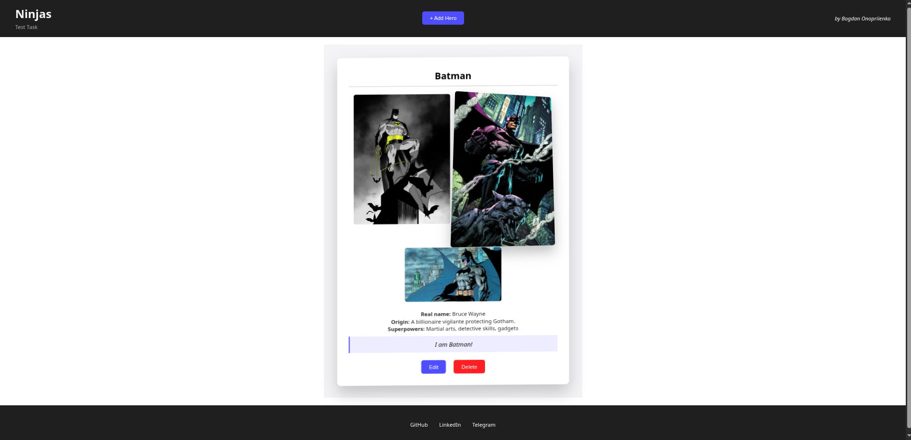

# Ninjas Inc — Intern JS (Full-Stack) Developer Task

The task is to implement a web application that allows CRUD operations for the Superhero model.  
**Deadline: 4 days**

---

## 🧰 Tech Stack
- Language: JavaScript
- Backend: Node.js (Express), Prisma ORM, PostgreSQL
- Frontend: React, React Router, React Query
- Styling: CSS
- Other: Multer (image upload handling), Docker Compose (PostgreSQL setup)

---

## Functional Requirements
The application provides the following features:

- Create, edit and delete a superhero
- Add and remove images when creating or editing a superhero
- Display a list of superheroes with pagination (5 items per page), showing one image and nickname for each
- View detailed information about a superhero, including all images (<i>Batman has multiple images<i/>)

---

## Project Structure
This is a monorepository:  
- <i>backend/<i/> — Express API  
- <i>frontend/<i/> — React web-application

--- 

## Installation & Setup
Before starting the application, make sure that you:
- have created a PostgreSQL database (or will run it with Docker Compose)
- updated the connection details in the .env file (see .env.example)
- and started the Docker container

### Clone the repository  
```
git clone git@github.com:bell-404err/Ninjas-Intern-JS-Full-Stack-Developer-Task.git
```

### Install dependencies
```
cd frontend/
npm install

cd backend/
npm install
```

### Start PostgreSQL with Docker Compose via Makefile
``` 
make up
```
<i>This will start a PostgreSQL instance based on the settings in your .env file.<i/>

### Run migrations and seed the database
```
npx prisma migrate dev --name init
npx prisma db seed
```

### Start the backend
```
npm run start
```

### Start the frontend
```
npm run start
```

## Screenshots
### Home page


### Superhero details

